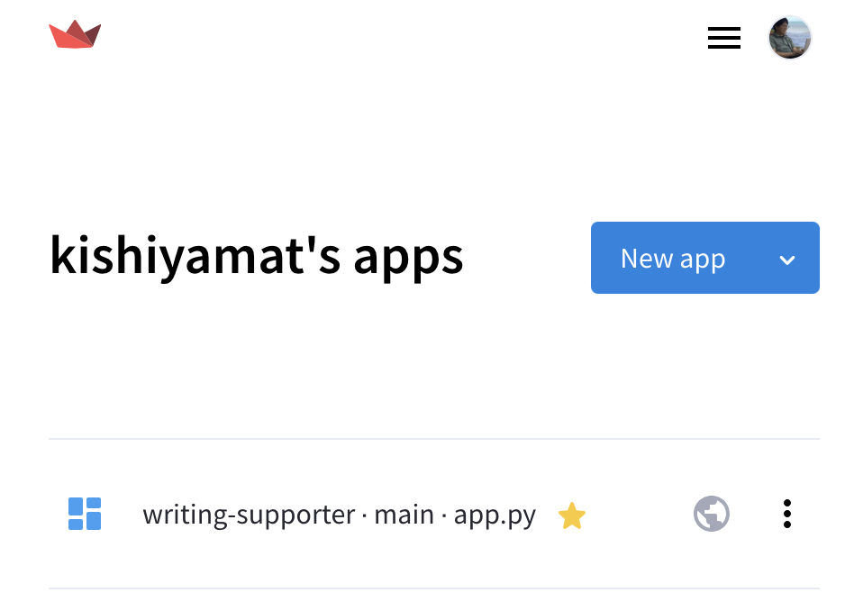
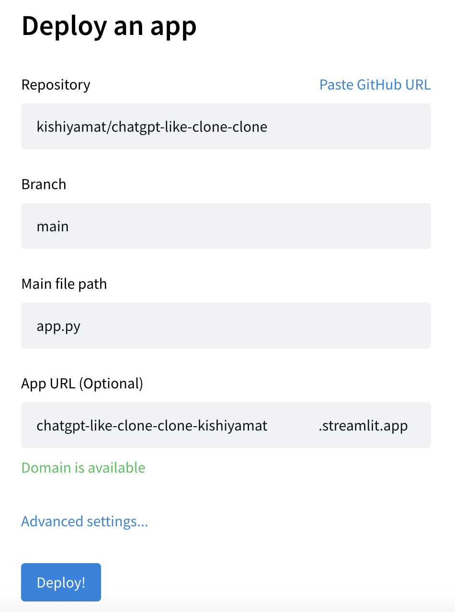
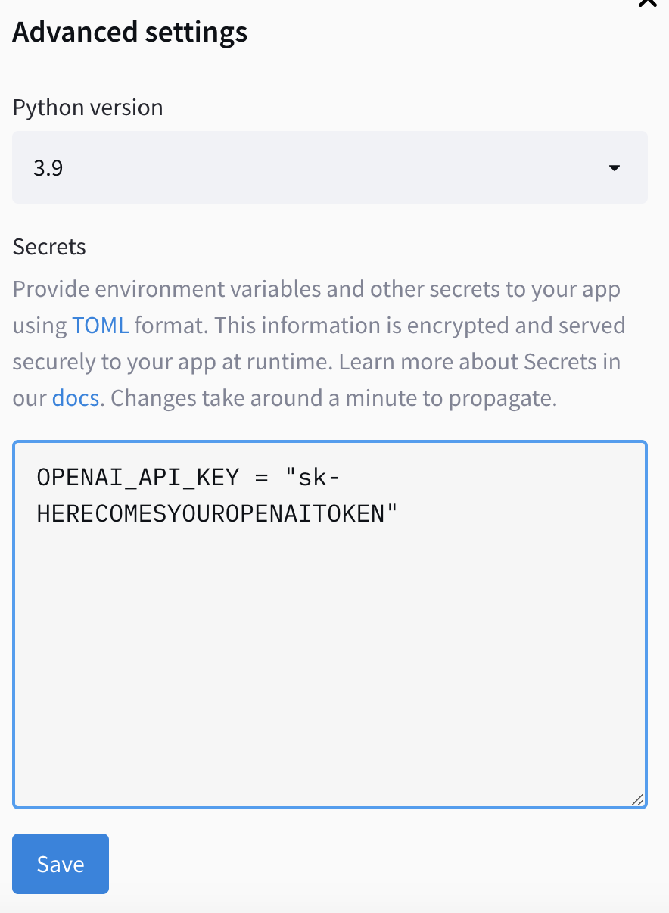

# ChatGPTクローン

実際に動くものは以下のリンクがあります。

- https://doc-chat-llm.streamlit.app/
    - Streamlitが公開しているもの。
    - 10回のやり取りに制限されている。
- https://chatgpt-like-clone-clone-kishiyamat.streamlit.app/
    - 岸山がcloneして公開しているもの。
    - 特に制限はない。
    - 岸山に請求が来る(ので、できれば上を使って欲しくはある)。

このREADMEは、Streamlitを使用してChatGPTのクローンを作る方法を説明します。以下のステップに従ってください。
基本的に最終的な成果物は
[Build a basic LLM chat app](docs.streamlit.io/knowledge-base/tutorials/build-conversational-apps#build-a-chatgpt-like-app)
ですが、GitHubなどの扱いが難しいと理解し難かったり、
インデントがわかりづらかったりするので補足してあります。

以下は、
(1) 本リポジトリを使って自身のPC経由でChatGPTを動かす方法
と
(2) ChatGPTをカスタマイズして公開する方法
です。

# ChatGPTクローンの作成方法（Streamlit版）

## 1. ターミナルを開く

- Windows: おそらくWSLを使うのが早いと思います。
- MacOS: Spotlightからterminalで調べると「ターミナル.app」が使えます。
- Linux: 一緒に頑張りましょう。

## 2. プロジェクトのクローン

まず、プロジェクトをあなたのマシンにクローンします。

```bash
git clone git@github.com:kishiyamat/chatgpt-like-clone-clone.git
cd chatgpt-like-clone-clone/
```

## 3. 仮想環境の作成

次に、Pythonの仮想環境を作成してアクティベートします。
本当はPyenvでPythonのバージョンを指定して
Poetryを使ってライブラリを管理するのがよくある方法だと思います。

```bash
python -V  # Python 3.9.10がインストールされていることを確認
python -m venv venv
activate venv/bin/python3.9
```

プロジェクトで必要なライブラリをインストールします。

```bash
pip install -r requirements.txt
```

## 4. OpenAI APIキーの設定

OpenAIのAPIキーを取得し、プロジェクトに設定します。これは、アプリケーションがOpenAIのサービスにアクセスするために必要です。

```bash
mkdir .streamlit
touch .streamlit/secret.toml
echo 'OPENAI_API_KEY = "sk-HERECOMESYOUROPENAITOKEN"' > .streamlit/secret.toml
# 注意: OPENAI_API_KEYの名前を変更しないでください（例: OPENAI_KEYやOPENAIAPIKEYは使用不可）
```

## 5. アプリケーションの起動

最後に、Streamlitアプリケーションを起動します。

```bash
streamlit run app.py
```

アプリケーションが起動したら、以下のURLでアクセスできます：

- ローカルURL: [http://localhost:8501](http://localhost:8501)
- ネットワークURL: [http://192.168.3.3:8501](http://192.168.3.3:8501)

これで、Streamlitを使ってChatGPTのクローンがローカル環境で動作するようになります。

# ChatGPTクローンの作成方法（Community Cloud版）

それぞれが自由にカスタマイズできるようになることを目的とするため、
このプロジェクトをまずは編集可能にします。
GitHubやStreamlit Cloudというサービスへの登録が必要になりますが、
この際に使えるようにすると捗ります。

## 1. このプロジェクトをFork

1. https://github.com/join にアクセス
1. GitHubに登録
1. https://github.com/kishiyamat/chatgpt-like-clone-clone をFork

具体的な手順は[公式ドキュメント](https://docs.github.com/ja/get-started/quickstart/fork-a-repo)を参照

## 2. Streamlit Cloudへの登録

1. https://share.streamlit.io/signup にアクセス
1. Continue with GitHub を選択
1. そのまま進める

## 3. デプロイ

1. https://share.streamlit.io/ にアクセス
1. New app を選択
   
1. Repositoryを選択
   
1. App URLを指定
1. **Token**を指定
   
1. Deploy!

